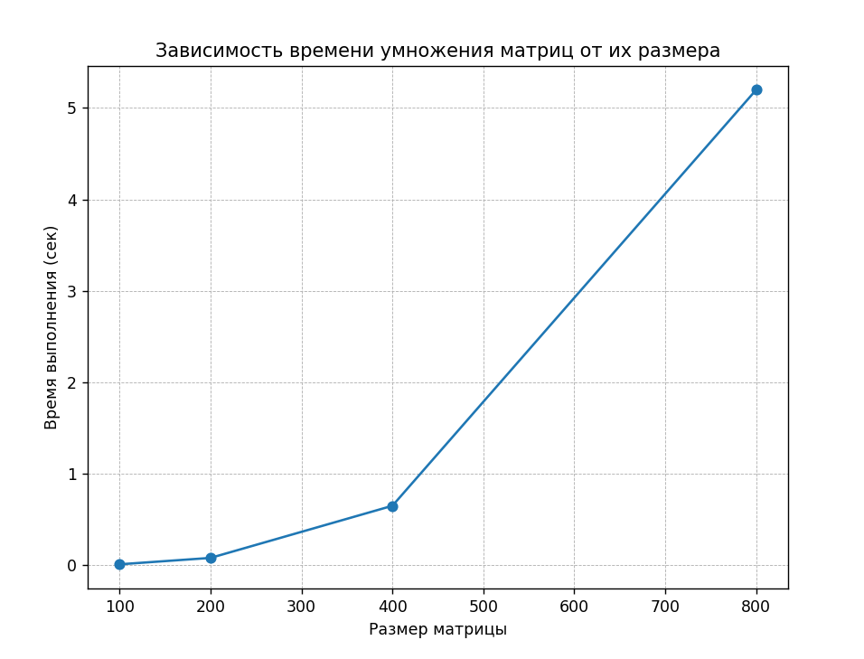

# Лабораторная работа №1  
Перемножение двух квадратных матриц

## Задание

Написать программу на языке C/C++ для перемножения двух квадратных матриц.

Исходные данные: файлы содержащие значения исходных матриц.

Выходные данные: файл со значениями результирующей матрицы, время выполнения, объем задачи.

Обязательна автоматизированная верификация результатов вычислений с помощью сторонних библиотек или стороннего ПО (например на Matlab/Python).

---

## Реализация

1. Генерация матриц: функция generate_matrix создает матрицу заданного размера со случайными значениями (от 0 до 99), сохраняет ее в файл.

2. Чтение матриц: функция read_matrix загружает матрицу из файла в виде двумерного вектора.

3. Умножение матриц: функция multiply_matrices реализует классический алгоритм умножения матриц с вложенными циклами, возвращая матрицу результата типа vector<vector<long long>> для предотвращения переполнения.

4. Запись результата: функция save_result сохраняет матрицу результата в файл.

5. Обработка разных размеров: в main() перебираются размеры матриц: 100, 200, 400, 800.

6. Измерение времени: используется chrono::high_resolution_clock для точного измерения времени умножения.

7. Расчет объема задачи: количество операций умножения и сложения для классического алгоритма равно 2 * size^3, что учитывается и выводится.

---

## Верификация

Для проверки корректности результатов использован Python и библиотека NumPy.  

В ходе проверки все тесты совпали.

---

## Исследование зависимости времени от размера матрицы

Обработка матриц размера 100x100

Время умножения: 0.012663 секунд

Объем задачи (операций): 2000000  

Обработка матриц размера 200x200

Время умножения: 0.0761796 секунд

Объем задачи (операций): 16000000

Обработка матриц размера 400x400

Время умножения: 0.638692 секунд

Объем задачи (операций): 128000000

Обработка матриц размера 800x800

Время умножения: 5.39609 секунд

Объем задачи (операций): 1024000000

| Размер | Время (сек) |
|----------|------------|
| 100 | 0.012663 |
| 200 | 0.0761796 |
| 400 | 0.638692 |
| 800 | 5.39609 |

При увеличении размера матрицы время выполнения значительно возрастает. 

Показательный график зависимости времени работы от размера матрицы:

---

## Вывод

Данная программа корректно перемножает матрицы.  
Результаты дополнительно проверены с помощью Python.  
Время выполнения растет примерно как N^3, что соответствует теоретической сложности алгоритма.
