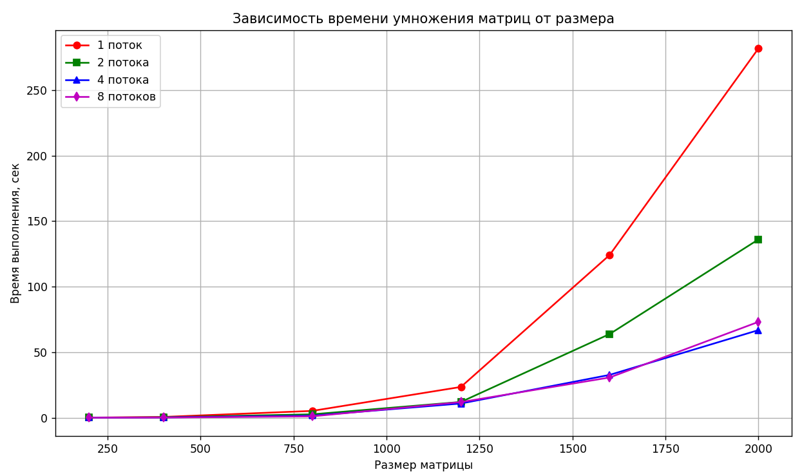

# Лабораторная работа №2  
Параллельная работа по технологии OpenMP

## Задание

Модифицировать программу из л/р №1 для параллельной работы по технологии OpenMP.  
Провести серию экспериментов с разным количеством потоков (1, 2, 4, 8 и т.д.), разными размерами матриц (примерно 200, 400, 800, 1200, 1600, 2000), с разным количеством вычислительных ядер при наличии технической возможности (1, 2, 4, 8 и т.д. ), иначе использовать фиксированное существующее количество вычислительных ядер, например 4.

---

## Реализация

1. Генерация матриц: функция generate_matrix создает матрицу заданного размера со случайными значениями (от 0 до 99), сохраняет ее в файл.

2. Чтение матриц: функция read_matrix загружает матрицу из файла в виде двумерного вектора.

3. Запись результата: функция save_result сохраняет матрицу результата в файл.

4. Параллельное умножение матриц: функция multiply_matrices_parallel() выполняет умножение матриц с использованием OpenMP.
Перед вычислением задаётся число потоков, затем внешний цикл распараллеливается. Каждый поток вычисляет часть строк матрицы результата.

5. Обработка разных размеров: в main() перебираются размеры матриц: 200, 400, 800, 1200, 1600, 2000 и разные потоки: 1, 2, 4, 8.

6. Измерение времени: используется chrono::high_resolution_clock для точного измерения времени умножения.

7. В программе рассматривается фиксированное количество ядер: 4

---

## Верификация

Для проверки корректности результатов использован Python и библиотека NumPy.  

В ходе проверки все тесты совпали.

---

## Исследование зависимости времени от размера матрицы и количества потоков

Обработка матриц размера 200x200                                                                      

Потоков: 1      Время: 0.0714194 секунд

Потоков: 2      Время: 0.0400124 секунд

Потоков: 4      Время: 0.0382888 секунд

Потоков: 8      Время: 0.0291326 секунд

Обработка матриц размера 400x400

Потоков: 1      Время: 0.572816 секунд

Потоков: 2      Время: 0.308597 секунд

Потоков: 4      Время: 0.188573 секунд

Потоков: 8      Время: 0.125439 секунд

Обработка матриц размера 800x800

Потоков: 1      Время: 5.17304 секунд

Потоков: 2      Время: 2.57237 секунд

Потоков: 4      Время: 1.53234 секунд

Потоков: 8      Время: 1.02483 секунд

Обработка матриц размера 1200x1200

Потоков: 1      Время: 23.4594 секунд

Потоков: 2      Время: 12.0068 секунд

Потоков: 4      Время: 10.8184 секунд

Потоков: 8      Время: 11.897 секунд

Обработка матриц размера 1600x1600

Потоков: 1      Время: 124.141 секунд

Потоков: 2      Время: 63.818 секунд

Потоков: 4      Время: 32.6619 секунд

Потоков: 8      Время: 30.6729 секунд

Обработка матриц размера 2000x2000

Потоков: 1      Время: 281.694 секунд

Потоков: 2      Время: 135.985 секунд

Потоков: 4      Время: 66.7994 секунд

Потоков: 8      Время: 73.0865 секунд

| Размер     | 1 поток    | 2 потока   | 4 потока   | 8 потоков  |
|------------|------------|------------|------------|------------|
| 200x200    | 0.0714194 | 0.0400124 | 0.0382888 | 0.0291326 |
| 400x400    | 0.572816  | 0.308597  | 0.188573  | 0.125439  |
| 800x800    | 5.17304   | 2.57237   | 1.53234   | 1.02483   |
| 1200x1200  | 23.4594   | 12.0068   | 10.8184   | 11.897    |
| 1600x1600  | 124.141   | 63.818    | 32.6619   | 30.6729   |
| 2000x2000  | 281.694   | 135.985   | 66.7994   | 73.0865   |

Для меньших размеров матриц (200x200, 400x400) ускорение при увеличении числа потоков заметно, особенно с 2 и 4 потоками.
Для очень больших матриц (1600x1600, 2000x2000) увеличение количества потоков до 4 даёт существенное снижение времени, однако при 8 потоках наблюдается незначительное снижение эффективности или даже рост времени (особенно заметно для 1200x1200 и 2000x2000). Это связано с накладными расходами на управление потоками и ограничениями аппаратных ресурсов.

При увеличении размера матрицы время выполнения растёт значительно, что говорит о высокой сложности операции.
Распараллеливание позволяет значительно сократить время выполнения, особенно для больших матриц, но с эффектом убывающей отдачи при использовании количества потоков, превышающего число физических ядер (в данном случае 4).

Показательный график зависимости времени работы от размера матрицы и количества потоков:

---

## Вывод

Реализация параллельного умножения матриц с помощью OpenMP показала хорошую эффективность, особенно при увеличении размеров матриц. Максимальное ускорение достигается при использовании 4 потоков.
