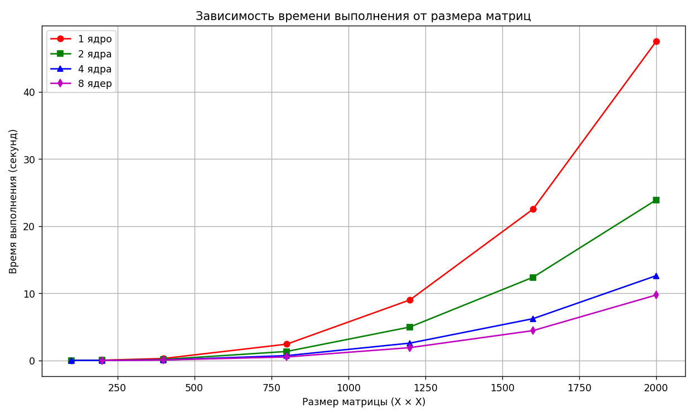

# Лабораторная работа №3  
Параллельная работа по технологии MPI

## Задание

Модифицировать программу из л/р №1 для параллельной работы по технологии MPI. 
Провести серию экспериментов с разными размерами матриц (примерно 200, 400, 800, 1200, 1600, 2000), с разным количеством вычислительных ядер (1, 2, 4, 8 и т.д.).

---

## Реализация

1. Генерация матриц: функция generate_matrix создает матрицу заданного размера со случайными значениями (от 0 до 99), сохраняет ее в файл.

2. Чтение матриц: функция read_matrix загружает матрицу из файла в виде двумерного вектора.

3. Запись результата: функция save_result сохраняет матрицу результата в файл.

4. Параллельное умножение матриц: программа использует MPI для распределения вычислений. Перед вычислением матрица A разбивается по строкам с помощью MPI_Scatter, а матрица B передается всем процессам через MPI_Bcast. Каждый процесс выполняет умножение своих строк матрицы A на матрицу B. После завершения локальных вычислений результаты собираются на основном процессе с помощью MPI_Gather.

5. Обработка разных размеров: в основном цикле перебираются размеры матриц: 200, 400, 800, 1200, 1600, 2000, а также различные числа процессов: 1, 2, 4, 8. Для каждого сочетания размеров и количества процессов происходит запуск вычислений и замер времени.

6. Измерение времени: используется chrono::high_resolution_clock для точного измерения времени умножения.

---

## Верификация

Для проверки корректности результатов использован Python и библиотека NumPy.  

В ходе проверки все тесты совпали.

---

## Исследование зависимости времени от размера матрицы и количества потоков

Обработка матриц размера 100×100

Ядер: 1      Время: 0.0088386 секунд

Ядер: 2      Время: 0.0037316 секунд

Ядер: 4      Время: 0.0055399 секунд

Ядер: 8      Время: не выполнено, размер не делится на 8

Обработка матриц размера 200×200

Ядер: 1      Время: 0.0359557 секунд

Ядер: 2      Время: 0.0190036 секунд

Ядер: 4      Время: 0.0149686 секунд

Ядер: 8      Время: 0.008956 секунд

Обработка матриц размера 400×400

Ядер: 1      Время: 0.290717 секунд

Ядер: 2      Время: 0.14744 секунд

Ядер: 4      Время: 0.0762068 секунд

Ядер: 8      Время: 0.0722815 секунд

Обработка матриц размера 800×800

Ядер: 1      Время: 2.42702 секунд

Ядер: 2      Время: 1.33846 секунд

Ядер: 4      Время: 0.716872 секунд

Ядер: 8      Время: 0.519315 секунд

Обработка матриц размера 1200×1200

Ядер: 1      Время: 9.00781 секунд

Ядер: 2      Время: 4.97438 секунд

Ядер: 4      Время: 2.57695 секунд

Ядер: 8      Время: 1.90777 секунд

Обработка матриц размера 1600×1600

Ядер: 1      Время: 22.5192 секунд

Ядер: 2      Время: 12.3783 секунд

Ядер: 4      Время: 6.21744 секунд

Ядер: 8      Время: 4.44104 секунд

Обработка матриц размера 2000×2000

Ядер: 1      Время: 47.4836 секунд

Ядер: 2      Время: 23.8892 секунд

Ядер: 4      Время: 12.6121 секунд

Ядер: 8      Время: 9.73771 секунд

| Размер матрицы | 1 ядро | 2 ядра | 4 ядра | 8 ядер |
|----------------|---------|---------|---------|---------|
| 100×100        | 0.0088386 | 0.0037316 | 0.0055399 | не выполнено, размер не делится на 8 |
| 200×200        | 0.0359557 | 0.0190036 | 0.0149686 | 0.008956 |
| 400×400        | 0.290717  | 0.14744   | 0.0762068 | 0.0722815 |
| 800×800        | 2.42702   | 1.33846   | 0.716872  | 0.519315 |
| 1200×1200      | 9.00781   | 4.97438   | 2.57695   | 1.90777 |
| 1600×1600      | 22.5192   | 12.3783   | 6.21744   | 4.44104 |
| 2000×2000      | 47.4836   | 23.8892   | 12.6121   | 9.73771 |

Из результатов видно, что с увеличением числа процессов время выполнения заметно уменьшается.
При переходе от 1 процесса к 2 и 4 процессам ускорение особенно заметно на больших матрицах. Это объясняется тем, что возрастает объём вычислений, который можно распараллелить между несколькими процессами.

Для матриц небольшого размера выигрыш от распараллеливания менее выражен, так как значительную долю времени составляют накладные расходы на запуск процессов, передачу данных и синхронизацию.

Наиболее хорошие результаты в данной серии экспериментов показал запуск с 8 процессами для размеров, кратных 8. 

Показательный график зависимости времени работы от размера матрицы и количества  вычислительных ядер:

---

## Вывод

В ходе лабораторной работы была успешно модифицирована программа умножения матриц для параллельной работы с использованием технологии MPI.
Были проведены эксперименты с различными размерами матриц и различным количеством вычислительных ядер.

Полученные результаты показывают, что MPI позволяет эффективно ускорять вычисления за счёт распределения работы между процессами и при увеличении размера матрицы выигрыш от параллелизма становится более заметным.
