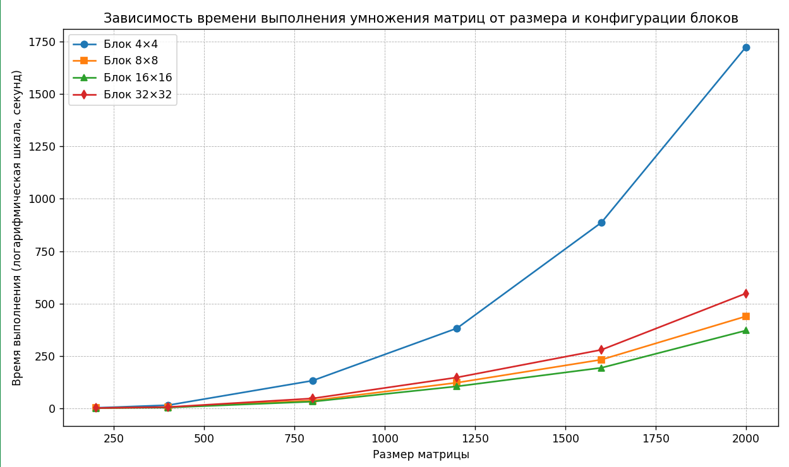

# Лабораторная работа №4  
Параллельная работа по технологии CUDA

## Задание

Модифицировать программу из л/р №1 для параллельной работы по технологии CUDA. 
Провести эксперименты с разными размерами матриц и различными конфигурациями сетки блоков.

---

## Реализация

1. Генерация матриц: функция generate_matrix создает матрицу заданного размера со случайными значениями (от 0 до 99).

2. Параллельное умножение матриц: реализовано ядро CUDA matrixMultiplyKernel, выполняющее умножение элементов по каждому потоку.

3. Настройка конфигурации: использованы блоки размеров 4×4, 8×8, 16×16 и 32×32, а также соответствующие сетки для обработки матриц разных размеров.

4. Измерение времени: используется chrono::high_resolution_clock для точного измерения времени умножения.

---

## Исследование зависимости времени от размера матрицы и конфигураций блоков

| Размер матрицы | Блок 4×4 | Блок 8×8 | Блок 16×16 | Блок 32×32 |
|----------------|----------|----------|------------|------------|
| 200            | 2.38     | 1.4765   | 1.2085     | 1.4878     |
| 400            | 14.9789  | 4.967    | 3.8657     | 6.0153     |
| 800            | 131.9768 | 37.1636  | 31.9765    | 47.1769    |
| 1200           | 382.192  | 122.377  | 104.824    | 147.3957   |
| 1600           | 886.6985 | 232.2646 | 193.3943   | 279.2877   |
| 2000           | 1724.037 | 438.9896 | 371.277    | 548.2933   |

Наблюдается экспоненциальный рост времени, что обусловлено увеличением количества операций умножения и размером матриц.

При небольших размерах матриц (например, 200) минимальная разница между конфигурациями блоков. Однако при росте размера матриц (800 и выше) более крупные блоки (например, 16×16 и 32×32) показывают меньшее время выполнения по сравнению с меньшими блоками, что свидетельствует о большей эффективности использования ресурсов GPU.

Показательный график зависимости времени работы от размера матрицы и конфигураций блоков:

---

## Вывод

Реализована параллельная версия умножения матриц на CUDA.

Проведены эксперименты, показывающие, что увеличение размера блока влияет на время выполнения, а оптимальный размер зависит от размера матриц.

Для больших задач лучше использовать блоки 16×16 или 32×32 для достижения лучшей производительности.
