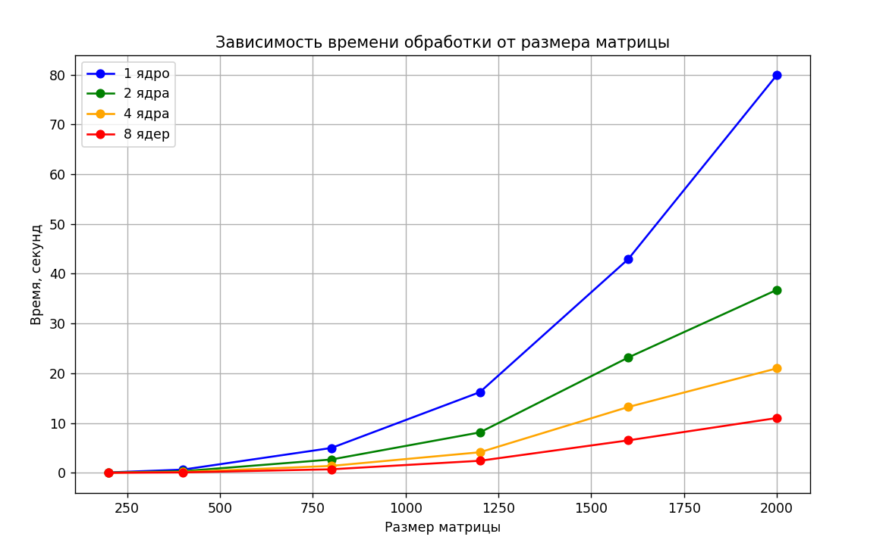

# Лабораторная работа №5 
Параллельная работа по технологии MPI на суперкомпьютере «Сергей Королёв»

## Задание

Параллельную версию программы на MPI, в ходе которой нужно было провести серию экспериментов с разными размерами матриц (примерно 200, 400, 800, 1200, 1600, 2000), с разным количеством вычислительных ядер (1, 2, 4, 8 и т.д.), запустить на суперкомпьютере «Сергей Королёв».

---

## Реализация

Для работы на суперкомпьютере код лабораторной работы №3 был немного скорректирован. Теперь программа выполняет генерацию матриц и делает все необходимые вычисления в ходе работы, без записи в файл и последующего изъятия из него. На выходе получаем лишь время, которое было потрачено на умножение матриц
Средства подключения:
PuTTY (SSH)
WinSCP (передача файлов)

Запуск был реализован при помощи следующего скрипта:

#!/bin/bash
#SBATCH --job-name=lab5
#SBATCH --time=0:05:00
#SBATCH --ntasks-per-node=1
#SBATCH --partition batch

module load intel/mpi4
mpirun -r ssh ./lab5

Запуск был произведён 4 раза, в каждый из которых значение аргумента node менялось (1, 2, 4, 8).

---

## Исследование зависимости времени от размера матрицы и количества потоков

Обработка матриц размера 200×200

Ядер: 1      Время: 0.0773129 секунд

Ядер: 2      Время: 0.039923 секунд

Ядер: 4      Время: 0.020318 секунд

Ядер: 8      Время: 0.0110686 секунд

Обработка матриц размера 400×400

Ядер: 1      Время: 0.641947 секунд

Ядер: 2      Время: 0.322111 секунд

Ядер: 4      Время: 0.16276 секунд

Ядер: 8      Время: 0.0830448 секунд

Обработка матриц размера 800×800

Ядер: 1      Время: 4.98991 секунд

Ядер: 2      Время: 2.67518 секунд

Ядер: 4      Время: 1.3911 секунд

Ядер: 8      Время: 0.710552 секунд

Обработка матриц размера 1200×1200

Ядер: 1      Время: 16.2054 секунд

Ядер: 2      Время: 8.1179 секунд

Ядер: 4      Время: 4.12818 секунд

Ядер: 8      Время: 2.41931 секунд

Обработка матриц размера 1600×1600

Ядер: 1      Время: 42.946 секунд

Ядер: 2      Время: 23.17 секунд

Ядер: 4      Время: 13.2254 секунд

Ядер: 8      Время: 6.5215 секунд

Обработка матриц размера 2000×2000

Ядер: 1      Время: 79.8968 секунд

Ядер: 2      Время: 36.7542 секунд

Ядер: 4      Время: 20.9798 секунд

Ядер: 8      Время: 11.0086 секунд

| Размер матрицы | 1 ядро    | 2 ядра    | 4 ядра    | 8 ядер     |
|----------------|-----------|-----------|-----------|------------|
| 200×200        | 0.0773129 | 0.039923  | 0.020318  | 0.0110686 |
| 400×400        | 0.641947  | 0.322111  | 0.16276   | 0.0830448 |
| 800×800        | 4.98991   | 2.67518   | 1.3911    | 0.710552  |
| 1200×1200      | 16.2054   | 8.1179    | 4.12818   | 2.41931   |
| 1600×1600      | 42.946    | 23.17     | 13.2254   | 6.5215    |
| 2000×2000      | 79.8968   | 36.7542   | 20.9798   | 11.0086   |

Показательный график зависимости времени работы от размера матрицы и количества вычислительных ядер:

---

## Вывод

В ходе лабораторной работы была успешно выполнена компиляция и запуск параллельной программы по технологии MPI на суперкомпьютере «Сергей Королёв».

Были получены навыки работы с удалённой вычислительной системой, включая передачу файлов, использование командной строки и системы очередей.
